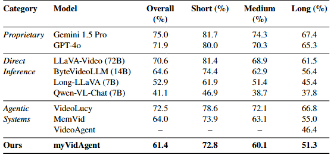

# myVidAgent: Long-Video Understanding via Agentic Memory Graphs

This repository contains the implementation of an agentic framework designed for deep understanding of long-form video content. By leveraging a multi-agent system and an **Evolving Memory Graph**, the system extracts features, constructs a world memory, and performs complex reasoning over extended durations.

  
---

## Project Overview
  

Traditional video models often struggle with temporal consistency in long-form content. This project addresses those challenges by splitting responsibilities across three specialized agents:
* **Multimodal Agent:** Handles feature extraction using **InsightFace** and performs entity clustering via **HDBSCAN**.
* **Memory Agent:** Dynamically builds and updates a graph-based world memory, using **Gemini** to generate semantic nodes from raw clusters.
* **Prompt Agent:** Executes retrieval and reasoning using a **ReAct** (Reasoning and Acting) framework to answer complex queries across the timeline.
> **Note:** The architectural diagrams can be found in the `/figs` folder.
---

## Architecture

The system follows a modular agentic architecture:

1.  **Feature Extraction Layer:** Processes raw video frames to identify recurring entities and actions.
2.  **Memory Construction Layer:** An Evolving Memory Graph that transforms raw visual data into a structured world memory.
3.  **Reasoning & Retrieval Layer:** Navigates the memory graph to provide context-aware answers to user queries.

  

---

## Technical Stack

* **Language:** Python 3.9-3.11
* **Vision & ML:** InsightFace, HDBSCAN
* **LLM/Reasoning:** Gemini API, ReAct Framework
* **Evaluation:** VidMME Benchmark
---

## VidMME Benchmark Result
  

## Getting Started

### Prerequisites
* Gemini API Key

### 1. Installation
```bash
# Install dependencies
pip install -r requirements.txt
```

### 2. Download Model Weights
The system uses **Qwen3** for complex multimodal reasoning and agentic tasks. Please download the weights for the specific vision-language and embedding models listed below:

* **Multimodal Reasoning:** [Qwen3-VL-4B-Instruct](https://huggingface.co/Qwen/Qwen3-VL-4B-Instruct)
* **Vector Embeddings:** [Qwen3-VL-Embedding-2B](https://huggingface.co/Qwen/Qwen3-VL-Embedding-2B)

**Placement:**
Download the following model weights and place them directly inside the existing `models/` folder:
```text
project-root/
└── models/
    ├── Qwen3-VL-4B-Instruct/
    └── Qwen3-VL-Embedding-2B/
```

### 3. Prepare Input Data
Raw Video: Place your raw video files (e.g., .mp4, .mkv) directly into the data/ folder.  
Pre-processing (Video Cutting): Use the provided script to segment your videos into clips for processing:
```bash
python cut_video.py
```
Metadata: Update data/data.jsonl to include the metadata and corresponding file paths for your input videos. Ensure the JSON structure matches the required input format for the agents.


### 4. Run the Memory Pipeline
Execute the memory agent module to begin the feature extraction and graph construction process using the following command:
```bash
python -m memagent.memorization_intermediate_outputs
python -m memagent.memory_graph
```

### 5. Querying (The ReAct Loop)
Once the Memory Graph has been successfully constructed, you can perform reasoning and retrieval tasks using the Prompt Agent.

Steps:
1. Open control.py
2. Update the user_question, and mem_path variables in the if __name__ == "__main__"
3. Run the script:
```bash
python -m memagent.control

